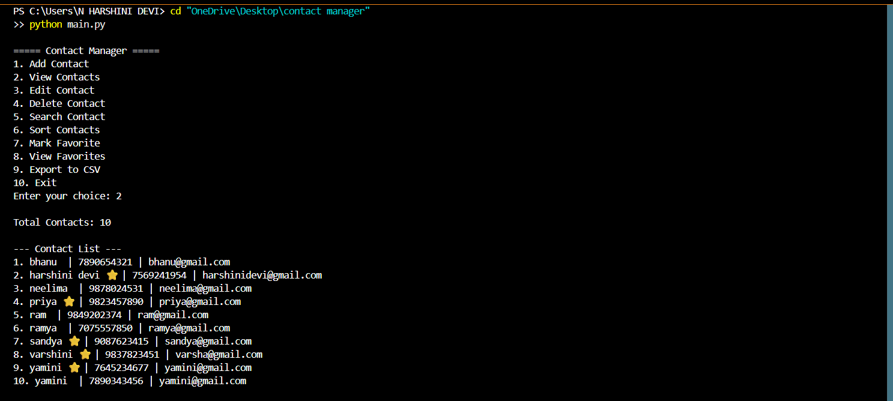

# 🚀 Contact Manager CLI (Python)
A feature-rich Command-Line Contact Management System built using Python that allows users to efficiently manage, search, and organize contacts with real-world functionalities like validation, favorites, and data persistence.
---

## 📌 Overview
This project simulates a real-world contact management system where users can perform all essential operations such as adding, updating, searching, and deleting contacts. It also includes advanced features like duplicate prevention, favorites management, and CSV export.
---

## ✨ Features

- ➕ Add new contacts with validation  
- 📋 View all contacts with total count  
- ✏️ Edit existing contacts  
- ❌ Delete contacts  
- 🔍 Search contacts by name, phone, or email  
- ⭐ Mark and view favorite contacts  
- 🚫 Prevent duplicate entries  
- 📁 Export contacts to CSV file  
- 💾 Persistent storage using JSON  
- 🧾 Clean and interactive CLI interface  
---
## 🛠️ Technologies Used
- Python 🐍  
- JSON (Data Storage)  
- CSV (Export Feature)  
---
## ▶️ How to Run
```bash
python main.py
```
## 📸 Preview



💡 Highlights
->Implements real-world CRUD operations
->Uses file handling (JSON & CSV)
->Includes validation and error handling
->Clean and user-friendly CLI design

🚀 Future Scope
->GUI version (Tkinter)
->Database integration (SQLite)

## Author
Harshini
       

